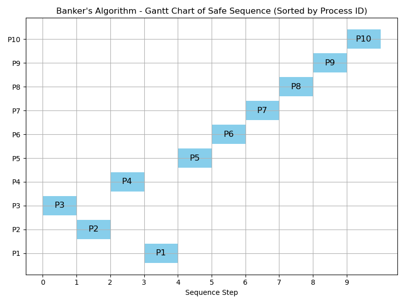
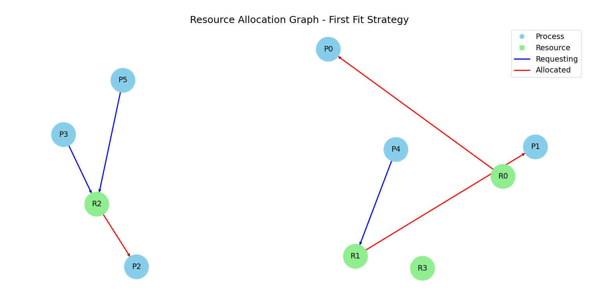
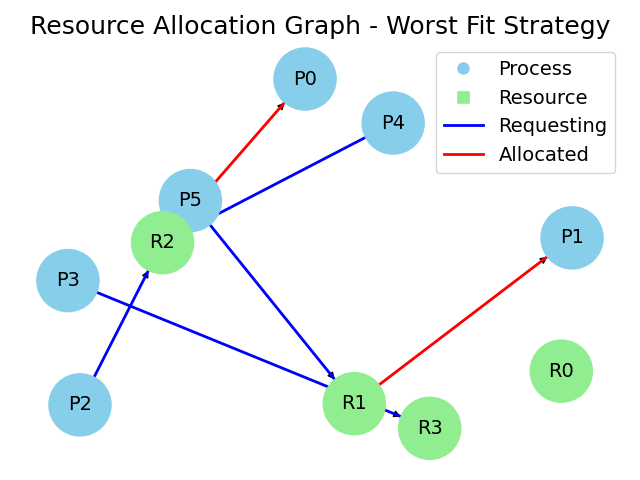
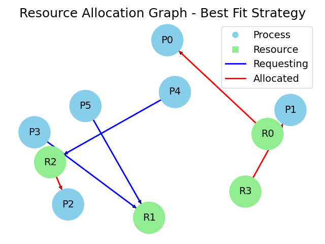
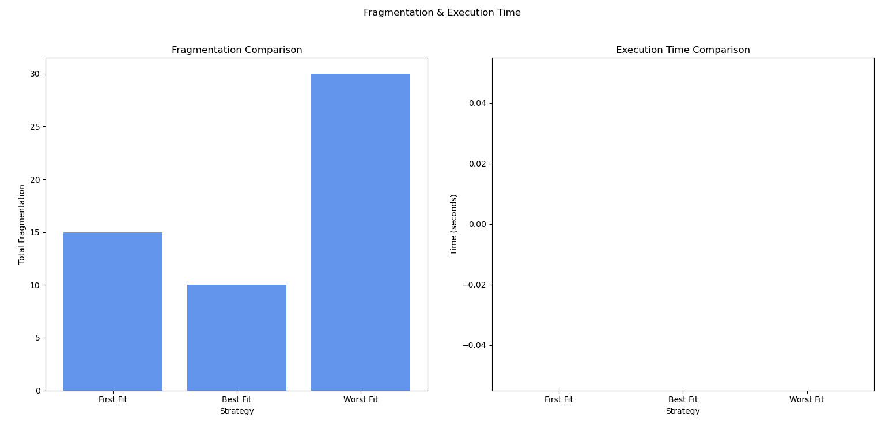

# Simulating and Analyzing Deadlock and Memory Allocation Strategies in Operating Systems

This project simulates memory allocation strategies—First Fit, Best Fit, Worst Fit—and implements the Banker's Algorithm to analyze system resource allocation, detect deadlocks, and evaluate overall memory performance. Visual outputs such as fragmentation comparison, execution time, resource allocation graphs, and safe sequences are generated for intuitive understanding.

---

## Members:
- De Justo, Izzy O.
- Fabul, Nathaniel C.
- Guiaya, Angelito Louise O.
- Semifrania, Joshua Jehiel M.
- Villarico, Lorenzo Noel A.

---

## Tools Used:
- Python
- matplotlib
- networkx

---

## Installation

Ensure Python is installed on your machine. Install required libraries using pip:

```bash
pip install matplotlib networkx
```

---

## Banker's Algorithm

```python
process_sequence = list(range(num_process))
arranged_sequence = []

k = 0
while k < len(max_need):
    if available + currently_holding[k] >= max_need[k]:
        available += currently_holding[k]
        arranged_sequence.append('P' + str(process_sequence[k] + 1))
        max_need.pop(k)
        currently_holding.pop(k)
        process_sequence.pop(k)
        k = 0
    else:
        k += 1
```

The Banker's Algorithm checks for a safe sequence of process execution without causing a deadlock. It calculates the available resources and iteratively determines whether each process can safely execute to completion. If a deadlock is detected, the system halts the simulation and outputs the blocked processes.



The algorithm ensures each process only runs when it has enough resources to complete, preventing deadlock situations. The diagonal pattern indicates sequential execution, where resources are released after each process completes.

---

## Memory Allocation Algorithms

### First Fit Strategy

```python
def first_fit(blocks, procs):
    alloc = [-1] * len(procs)
    mem = blocks.copy()
    frag = 0

    for i, p in enumerate(procs):
        for j, b in enumerate(mem):
            if b >= p:
                alloc[i] = j
                frag += b - p
                mem[j] -= p
                break
    return alloc, mem, frag
```

The First Fit strategy allocates the first memory block that is large enough for the process. It is straightforward and fast but can lead to memory fragmentation.



This Resource Allocation Graph illustrates how resources (R0-R3, shown in green) are distributed among processes (P0-P5, shown in blue) using the First Fit memory allocation strategy. The red arrows indicate resources that are currently allocated to processes (like R0 to P0 and P1), while blue arrows show pending resource requests from processes (such as P3 and P5 requesting R2). The graph reveals potential resource conflicts and helps identify possible deadlock situations, with R3 being the only completely unused resource while other resources are either allocated or have pending requests.

---

### Worst Fit Strategy

```python
def worst_fit(blocks, procs):
    alloc = [-1] * len(procs)
    mem = blocks.copy()
    frag = 0

    for i, p in enumerate(procs):
        worst_idx = -1
        max_left = -1
        for j, b in enumerate(mem):
            if b >= p and b - p > max_left:
                worst_idx = j
                max_left = b - p
        if worst_idx != -1:
            alloc[i] = worst_idx
            frag += mem[worst_idx] - p
            mem[worst_idx] -= p
    return alloc, mem, frag
```

The Worst Fit strategy allocates the process to the largest available memory block. This aims to reduce the creation of small unusable fragments.



This Resource Allocation Graph demonstrates the Worst Fit memory allocation strategy, where resources (R0-R3 in green) are connected to processes (P0-P5 in blue) through allocation and request relationships. The red arrows show current resource allocations (like R2 to P5 and R1 to P1), while blue arrows indicate pending resource requests (such as P3 and P2 requesting R2, and P4 requesting R1), creating a more complex web of resource dependencies. The graph reveals potential inefficiencies of the Worst Fit strategy, as shown by the clustering of requests around certain resources (particularly R2 and R1) while R0 and R3 appear less utilized, which is characteristic of this allocation method's tendency to create uneven resource distribution.

---

### Best Fit Strategy

```python
def best_fit(blocks, procs):
    alloc = [-1] * len(procs)
    mem = blocks.copy()
    frag = 0

    for i, p in enumerate(procs):
        best_idx = -1
        min_left = float('inf')
        for j, b in enumerate(mem):
            if b >= p and (b - p) < min_left:
                best_idx = j
                min_left = b - p
        if best_idx != -1:
            alloc[i] = best_idx
            frag += mem[best_idx] - p
            mem[best_idx] -= p
    return alloc, mem, frag
```

The Best Fit strategy finds the memory block that leaves the smallest leftover space after allocation, reducing overall fragmentation but potentially increasing search time.



This Resource Allocation Graph depicts the Best Fit memory allocation strategy, showing the interaction between processes (P0-P5 in blue circles) and resources (R0-R3 in green squares). The red arrows indicate current resource allocations (R0 to P0 and P1, R2 to P2), while blue arrows show pending resource requests (P3, P4, and P5 requesting R1 and R2), demonstrating how the Best Fit strategy attempts to minimize memory wastage by matching process needs to the most suitable resources. The graph's structure reveals a more balanced distribution of resources compared to other strategies, with R3 connected to R0 and multiple processes making strategic requests to R1 and R2, reflecting the Best Fit's characteristic of optimizing resource utilization.

---

## Performance Analysis

This section compares the three strategies based on fragmentation and execution time.



Based on the graphs comparing the First Fit, Best Fit, and Worst Fit memory allocation strategies, Best Fit demonstrates the lowest fragmentation (approximately 10 units), followed by First Fit with moderate fragmentation (around 15 units), and Worst Fit with the highest fragmentation (about 30 units). All three strategies exhibit similar execution times (close to 0 seconds), indicating that performance is not significantly affected by the choice of strategy in this implementation. Overall, the Best Fit strategy emerges as the best-performing option.

---

## Notes

- This project effectively demonstrates the trade-offs between different memory allocation strategies.
- All graphs and charts are generated using `matplotlib` and `networkx`.
- Each memory allocation strategy also visualizes a Resource Allocation Graph (RAG) to illustrate allocation and request states.
- The safe sequence Gantt chart visually explains the outcome of the Banker's Algorithm.
- Visualization is a powerful method for understanding how system-level processes and memory management operate.
